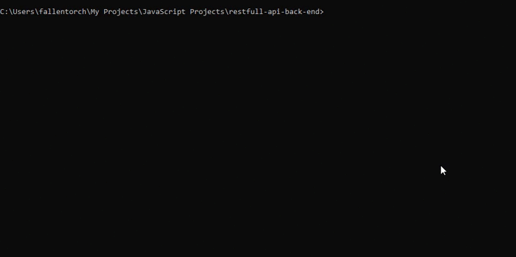

# Getting started

Open CMD or Terminal and execute next commands:  

  Download project  
    1. `git clone https://github.com/dmytrohryb/restfull-api-back-end.git`  
    2. `cd restfull-api-back-end`  
    3. `npm install`  

If necessary, the MySQL port and other settings can be changed in the file `./config/env.js`

# Example testing 

  Start test  
    1. `node setup-test-env.js`  
    2. `npm test`
  
  Important before each test run, you must run the command `node setup-test-env.js`  
    
# Example production  
  Start prod  
    1. `node setup-prod-env.js`  
    2. `npm start`  
